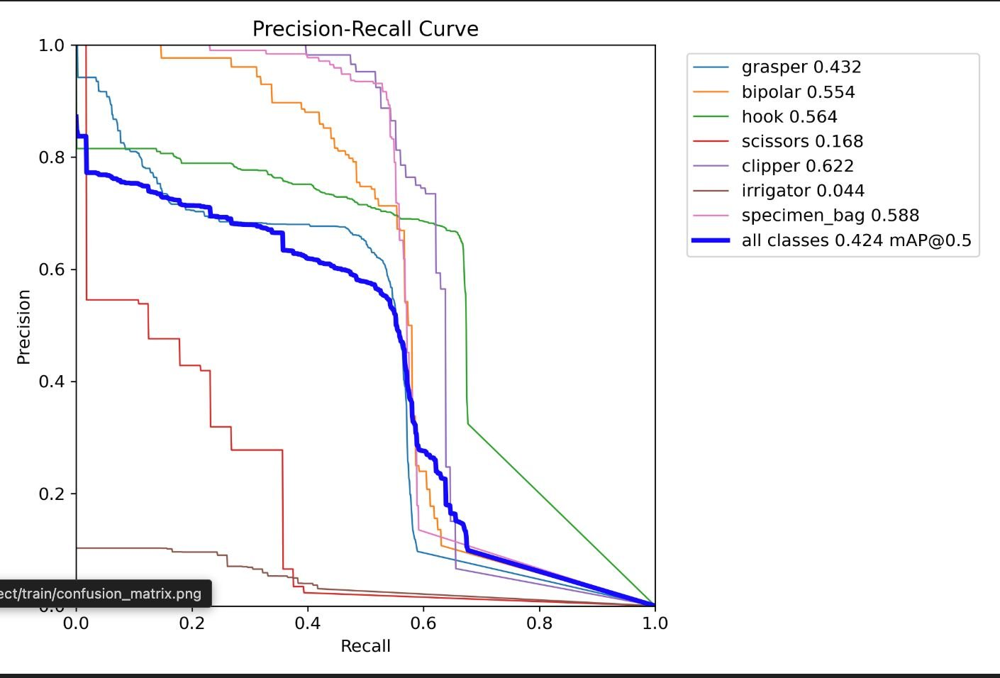
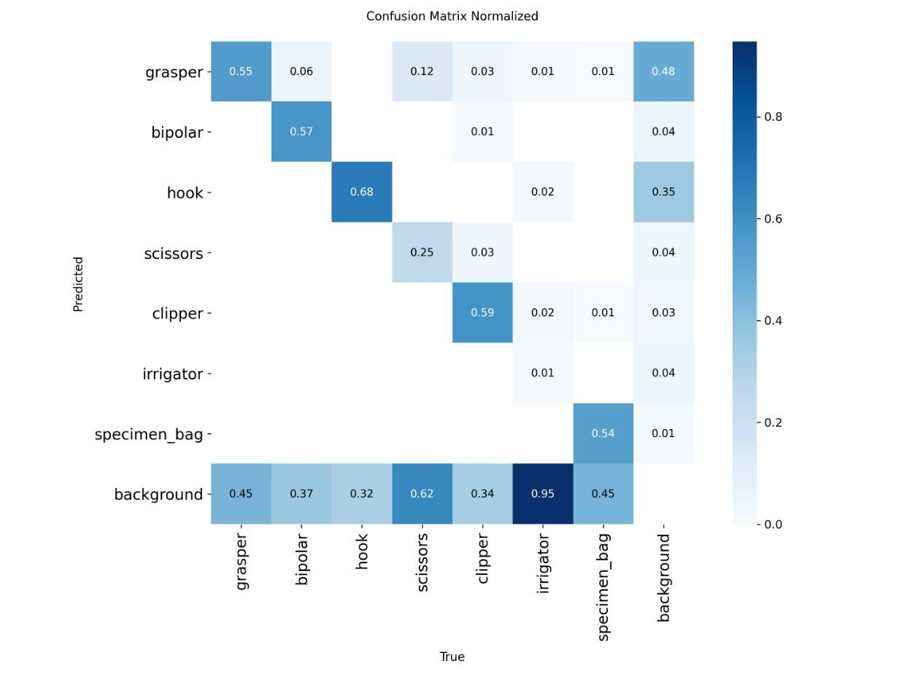
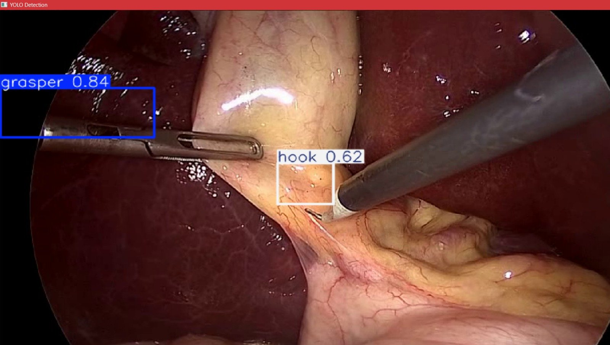
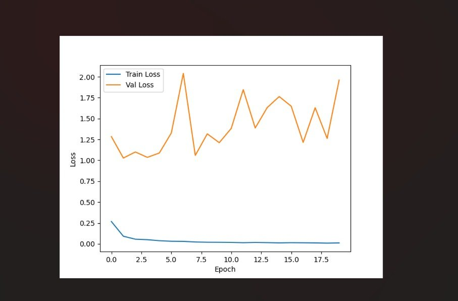
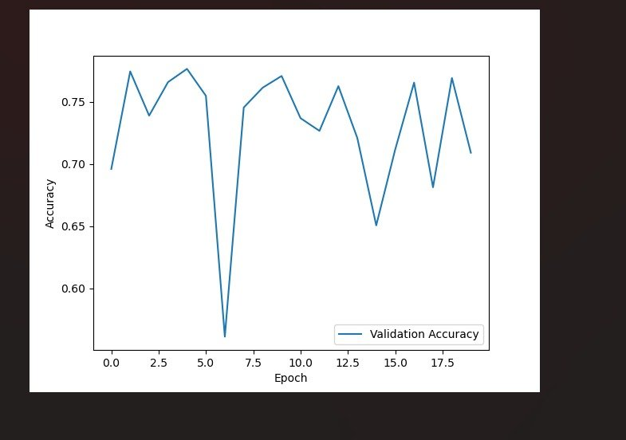
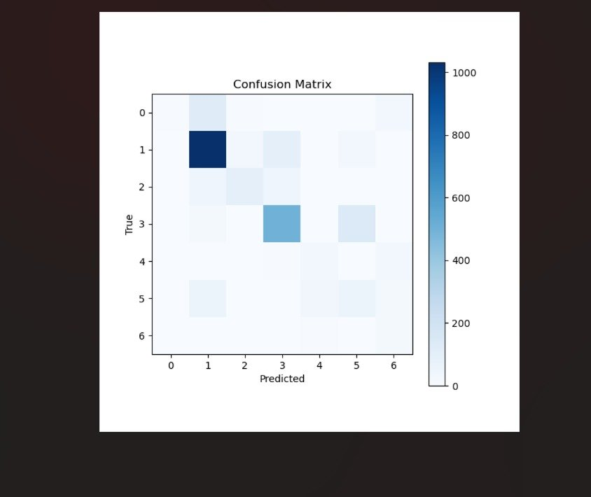

# SurgiMind — Surgical Intelligence Platform

A dual-model AI system for real-time laparoscopic surgery analysis. The platform detects surgical instruments frame-by-frame using YOLOv8, and recognizes the current surgical phase using a CNN-LSTM sequence model — enabling intelligent, context-aware intraoperative assistance.

---

## Overview

SurgiMind combines two complementary models to understand what is happening inside the OR at any given moment:

- **Instrument Detection** (YOLOv8): Detects and localizes up to 7 surgical tools in each frame with bounding boxes and confidence scores.
- **Phase Recognition** (CNN-LSTM): Classifies the current phase of a laparoscopic cholecystectomy from a rolling window of 10 frames using temporal context.

Both models feed into a shared backend that generates structured reports for surgeons, researchers, and medical educators.

---

## Models

### 1. Instrument Detection — YOLOv8

Detects 7 instrument classes in laparoscopic video frames.

| Class | AP@0.5 |
|---|---|
| grasper | 0.432 |
| bipolar | 0.554 |
| hook | 0.564 |
| scissors | 0.168 |
| clipper | 0.622 |
| irrigator | 0.044 |
| specimen_bag | 0.588 |
| **all classes (mAP@0.5)** | **0.424** |

Key observations from the confusion matrix:
- Irrigator is severely underrepresented in training data (AP: 0.044), causing near-total misclassification as background (0.95).
- Hook (0.68) and clipper (0.59) are the strongest performers.
- All classes suffer significant background confusion — a known challenge in instrument detection where tools are frequently partially occluded or off-screen.

### 2. Surgical Phase Recognition — CNN-LSTM

Classifies one of 7 cholecystectomy phases from a sequence of 10 frames.

| Phase ID | Phase Name |
|---|---|
| 0 | Preparation |
| 1 | Calot Triangle Dissection |
| 2 | Clipping & Cutting |
| 3 | Gallbladder Dissection |
| 4 | Gallbladder Packaging |
| 5 | Cleaning & Coagulation |
| 6 | Gallbladder Retraction |

**Architecture:** ResNet-18 CNN feature extractor → single-layer LSTM (hidden size 256) → fully connected classifier.

**Training notes:**
- Validation accuracy oscillates between ~65–80%, peaking around epoch 2–5.
- Training loss converges near zero rapidly while validation loss diverges — a strong sign of **overfitting**, likely due to limited video diversity in the training split.
- Phase 1 (Calot Triangle Dissection) dominates the dataset and is predicted most confidently; rare phases (4, 6) are poorly learned.

---

## Dataset

The project uses the **CholecTrack20** dataset, downloaded via the Synapse platform.

**Dataset structure expected per video:**
```
VID01/
├── Frames/          # extracted .jpg frames
└── annotations.json # frame-level instrument + phase labels
```

**JSON annotation format:**
```json
{
  "annotations": {
    "42": [
      {
        "instrument": 2,
        "tool_bbox": [0.51, 0.38, 0.12, 0.09],
        "phase": 1
      }
    ]
  }
}
```

Bounding boxes are in normalized YOLO format `[x_center, y_center, width, height]`.

---

## Setup

### Requirements

```bash
pip install torch torchvision ultralytics pdfplumber pytesseract pdf2image pillow opencv-python flask werkzeug scikit-learn matplotlib tensorboard
```

### Dataset Download

Configure `.env`:

```
email=your_synapse_email
auth_token=your_synapse_token
acesskey=your_access_key
```

Then run:

```bash
python download_script.py
```

After downloading, push to S3:

```bash
aws s3 cp ./data s3://your-bucket/ --recursive
```

### Convert to YOLO Format

```bash
python coversion.py
```

This reads `Training/` and `Validation/` directories and outputs a YOLO-compatible dataset to `yolo_dataset/`.

---

## Training

### Instrument Detection (YOLOv8)

Designed for AWS SageMaker. Expects `data.yaml` at `/opt/ml/input/data/train/`.

```bash
python train.py
```

Model checkpoints are saved to `/opt/ml/model/yolo-exp/`.

### Phase Recognition (CNN-LSTM)

```bash
python train_phase.py \
  --epochs 30 \
  --batch-size 4 \
  --seq-len 10 \
  --lr 1e-4 \
  --num-phases 7
```

Set `SM_CHANNEL_TRAIN`, `SM_CHANNEL_VAL`, and `SM_MODEL_DIR` environment variables for SageMaker, or let them default to `./data/train`, `./data/val`, and `./models`.

TensorBoard logs are written to `{model_dir}/runs`. Best model saved as `best_model.pth`.

---

## Inference

### Real-Time Local Demo

```bash
python real_timedemo.py
```

Update `MODEL_PATH` and `VIDEO_PATH` in the script before running. Displays phase label and confidence overlaid on video. Press `Esc` to exit.

### Phase Detection Service (Flask)

```python
from phase_detection_service import run_phase_detection

result = run_phase_detection("path/to/video.mp4")
# Returns:
# {
#   "total_frames": 4200,
#   "timeline": [
#     {"frame": 10, "phase": "CalotTriangleDissection", "confidence": 0.812},
#     ...
#   ]
# }
```

Place `best_phase.pth` in the project root before starting the server.

---

## Report Generation

`reports_service.py` extracts content from medical PDF reports for downstream AI summarization.

```python
from reports_service import ReportExtractor

extractor = ReportExtractor("patient_report.pdf")
combined_text = extractor.extract_all()
# Returns concatenated text, OCR output, and table data
```

Accepted upload formats (via Flask): `.pdf`, `.dcm`, `.jpg`, `.jpeg`, `.png`

---

## Known Issues & Improvements

| Issue | Root Cause | Suggested Fix |
|---|---|---|
| Irrigator AP near zero | Extreme class imbalance | Oversample irrigator frames; use focal loss |
| Phase model overfitting | Few training videos | Add dropout, stronger augmentation, more videos |
| Validation accuracy unstable | Small val set, class imbalance | Stratified splits; weighted loss already applied |
| Background confusion in YOLO | Partial occlusion, small tools | Mosaic augmentation; anchor tuning |
| `None` cells crash table extraction | Sparse PDF tables | Fixed in updated `reports_service.py` with coercion |

---

## Results

### Instrument Detection — YOLOv8

#### Precision-Recall Curve

The PR curve shows per-class detection performance at IoU threshold 0.5. Clipper (0.622) and specimen_bag (0.588) lead the per-class APs, while irrigator (0.044) is nearly undetectable due to severe class imbalance. Overall mAP@0.5 is **0.424**.



#### Confusion Matrix (Normalized)

The normalized confusion matrix reveals that most classes suffer significant false-negative leakage into the background class. Irrigator is predicted as background 95% of the time. Hook achieves the highest true-positive rate at 0.68.



#### Sample Inference

Real-time inference on a laparoscopic cholecystectomy frame from the CholecTrack20 public research dataset. The model simultaneously detects a grasper (confidence: 0.84) and a hook (confidence: 0.62) with accurate bounding box localization.



---

### Surgical Phase Recognition — CNN-LSTM

#### Training & Validation Loss

Training loss converges to near zero within the first 5 epochs. Validation loss, however, diverges and oscillates between 1.0–2.0 — a clear sign of overfitting driven by limited training video diversity. The best checkpoint is saved at the epoch with lowest validation loss.



#### Validation Accuracy

Validation accuracy peaks at ~78% in early epochs and stabilizes in the 70–78% range for most of training, with occasional drops (e.g., epoch 6) likely corresponding to the model momentarily over-specializing on dominant phases before the learning rate scheduler corrects course.



#### Confusion Matrix (Phase Recognition)

Phase 1 (Calot Triangle Dissection) is the most confidently predicted class, consistent with its dominance in the dataset. Rare phases such as Gallbladder Packaging (4) and Gallbladder Retraction (6) show significant misclassification into phase 1 and phase 3, reflecting the class imbalance in the training split.



---

## Contributors

- [Mohd Rayyan bin Mohd Jaweed](https://github.com/rayyanrbj09)
- [Syed Saad Ahmed](https://github.com/syedsaad9218))
- [Mohd Sofiyaan](https://github.com/Sofiyaan12)

---

## Acknowledgements

- Dataset: [CholecTrack20](https://github.com/CAMMA-public/cholectrack20) by Chinedu I. Nwoye et al., IHU Strasbourg
- Detection backbone: [Ultralytics YOLOv8](https://github.com/ultralytics/ultralytics)
- Phase recognition backbone: ResNet-18 via [torchvision](https://pytorch.org/vision/)
